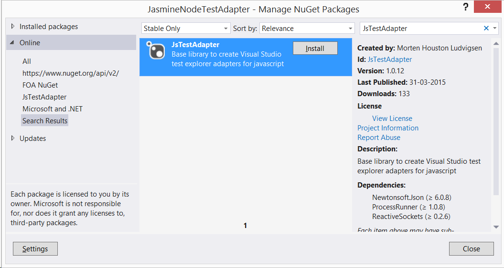
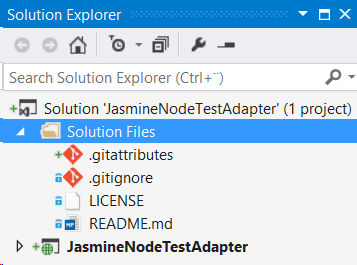

***This document is under construction!***

To demonstrate how this library is used I will implement a test adapter for [Jasmine](http://jasmine.github.io/) tests run in [Node.js](https://nodejs.org/).

The test adapter will be found on GitHub: [JasmineNodeTestAdapter](https://github.com/MortenHoustonLudvigsen/JasmineNodeTestAdapter).

# Prerequisites

Before creating a test adapter using JsTestAdapter the following should be installed:

* [Node.js](https://nodejs.org/)

* [Microsoft Visual Studio 2013 SDK](https://visualstudiogallery.msdn.microsoft.com/842766ba-1f32-40cf-8617-39365ebfc134)

* Visual Studio extension [Task Runner Explorer](https://visualstudiogallery.msdn.microsoft.com/8e1b4368-4afb-467a-bc13-9650572db708)

* Visual Studio extension [TypeScript 1.4 for Visual Studio 2013](https://visualstudiogallery.msdn.microsoft.com/2d42d8dc-e085-45eb-a30b-3f7d50d55304)

It might also be helpful to install:

* Node module [Grunt CLI](http://gruntjs.com/using-the-cli)

  ````bat
  npm install -g grunt-cli
  ```` 

* Node module [tsd](https://www.npmjs.com/package/tsd)

  ````bat
  npm install -g tsd
  ````

* Visual Studio extension [File Nesting](https://visualstudiogallery.msdn.microsoft.com/3ebde8fb-26d8-4374-a0eb-1e4e2665070c)

# Architecture

The test adapter will be made up of three components:

* The Jasmine runner
  This will be a node program, that runs a set of Jasmine tests once, and reports the results to the test server. 

* The test server
  This will be a node program, that runs in the background running the Jasmine runner when needed, and reporting the results to the test adapter.

* The test adapter
  This will be the Test Explorer adapter, implementet in C#, that will start a test server for each set of tests, and will respond to events from the test servers by updating the Test Explorer.

## Configuration

The test adapter will be configured using a JSON file named `JasmineNodeTestAdapter.json`.

````JSON
{
    "$schema": "http://MortenHoustonLudvigsen.github.io/JasmineNodeTestAdapter/JasmineNodeTestAdapter.schema.json",
    "Name": "My tests",
    "BasePath": ".",
    "Helpers": [ "specs/**/*[Hh]elper.js" ],
    "Specs": [ "specs/**/*[Ss]pec.js" ],
    "Watch": [ "src/**/*.js" ],
    "BatchInterval": 250,
    "Extensions": "./Extensions",
    "Traits": [ "Jasmine", { "Name": "Foo", "Value": "Bar" } ],
    "Disabled": false,
    "LogToFile": true,
    "LogDirectory": "TestResults/JasmineTestAdapter"
}
````   

These are the possible properties (all properties are optional):

* `$schema` Set to "<http://MortenHoustonLudvigsen.github.io/JasmineNodeTestAdapter/JasmineNodeTestAdapter.schema.json>" to get
  intellisense for `JasmineNodeTestAdapter.json`.

* `Name` The name of the test container. Used in the default generation of the fully qualified name for each test.

* `BasePath` The base path to use to resolve file paths. Defaults to the directory in which `JasmineNodeTestAdapter.json` resides.

* `Helpers` Non-source, non-spec helper files. Loaded before any specs. Wildcards can be used - see [glob](https://www.npmjs.com/package/glob).

* `Specs` Files containing Jasmine specs. Wildcards can be used - see [glob](https://www.npmjs.com/package/glob).

* `Watch` A test run is triggered if any file specified in `Helpers` or `Specs` change. Add any files in `Watch` that should also trigger a test run when they change. These will typically be the source files. Wildcards can be used - see [glob](https://www.npmjs.com/package/glob).

* `BatchInterval` When the test adapter is watching files for changes, it will wait `BatchInterval` ms before running tests. Default value is 250.

* `Traits` An array of traits to be attached to each test. A trait can be a string or an object containing properties `Name` and `Value`. A trait specified as a string or with only a name will be shown in the Test Explorer as just the string or name.

* `Extensions` Path to a node.js module implementing extensions.

* `Disabled` Set to true, if the test adapter should be disabled for this configuration file.

* `LogToFile` Set to true, if you want the adapter to write log statements to a log file (named JasmineNodeTestAdapter.log).

* `LogDirectory` Where the log file should be saved (if LogToFile is true). If this property is not specified the directory in which JasmineNodeTestAdapter.json resides is used.

`JasmineNodeTestAdapter.json` must be encoded in one of the following encodings:

* UTF-8
* UTF-8 with BOM / Signature
* UTF-16 Big-Endian with BOM / Signature
* UTF-16 Little-Endian with BOM / Signature

# Set up solution and project

Create a new "HTML Application with TypeScript" in Visual Studio 2013 called "JasmineNodeJsTestAdapter" (make sure to check `Create directory for solution`).


Once this is done, the solution explorer should look something like this:


Delete all the files, that are added by default:


In the properties for the project make sure typescript files are compiled as "CommonJS" modules:


Now the JsTestAdapter NuGet package is installed:



Once JsTestAdapter is installed the solution should look something like this:


The Task Runner Explorer looks like (it might be necessary to run `nmp install` from a command prompt, and to click the Refresh button in the Task Runner Explorer):


I can now build the solution, and double click the `CreatePackage` grunt task in the Task Runner Explorer. If I show all files in the Solution Explorer, I should see that a package `JasmineNodeJsTestAdapter.vsix` has been created:


To automate the creation of the package we bind the `CreatePackage` task to the `After Build` event in the Task Runner Explorer:


From now on the package `JasmineNodeJsTestAdapter.vsix` will be created after every build.

## Solution level files

To keep track of solution level files, I create a new solution folder `Solution Files`, and add the files in the solution directory: 



Notice, that I have created a `LICENSE` file with the MIT License.

## package.json

A `package.json` file has been generated, and looks like:

````Json
{
  "name": "JasmineNodeTestAdapter",
  "version": "0.0.1",
  "private": true,
  "devDependencies": {
    "extend": "^2.0.0",
    "flatten-packages": "^0.1.4",
    "grunt": "^0.4.5",
    "grunt-contrib-clean": "^0.6.0",
    "grunt-contrib-compress": "^0.13.0",
    "grunt-contrib-copy": "^0.8.0",
    "grunt-exec": "^0.4.6",
    "grunt-nuget": "^0.1.4",
    "grunt-xmlpoke": "^0.8.0",
    "regedit": "^2.1.0",
    "semver": "^4.3.1",
    "string-template": "^0.2.0",
    "xmlbuilder": "^2.6.2",
    "zpad": "^0.5.0"
  },
  "dependencies": {
    "error-stack-parser": "^1.1.2",
    "iconv-lite": "^0.4.7",
    "q": "^1.2.0",
    "source-map": "^0.4.0",
    "source-map-resolve": "^0.3.1",
    "stackframe": "^0.2.2",
    "yargs": "^3.5.4"
  }
}
````

The version of the package `JasmineNodeJsTestAdapter.vsix` is generated from the `version` property in `package.json` when the `CreatePackage` task is run, so this is where the current version of the package is maintained.

## source.extension.vsixmanifest

A `source.extension.vsixmanifest` file has been generated, and looks like:

````xml
<?xml version="1.0" encoding="utf-8"?>
<PackageManifest Version="2.0.0" xmlns="http://schemas.microsoft.com/developer/vsx-schema/2011">
  <Metadata>
    <Identity Id="JasmineNodeTestAdapter.25d980f5-bb63-4cae-8dd4-b165922e9c98" Version="x.x.x" Language="en-US" Publisher="" />
    <DisplayName>JasmineNodeTestAdapter</DisplayName>
    <Description xml:space="preserve">JasmineNodeTestAdapter</Description>
    <MoreInfo></MoreInfo>
    <License></License>
  </Metadata>
  <Installation>
    <InstallationTarget Version="[12.0,14.0]" Id="Microsoft.VisualStudio.Pro" />
    <InstallationTarget Version="[12.0,14.0]" Id="Microsoft.VisualStudio.Premium" />
    <InstallationTarget Version="[12.0,14.0]" Id="Microsoft.VisualStudio.Ultimate" />
  </Installation>
  <Dependencies>
    <Dependency Id="Microsoft.Framework.NDP" DisplayName="Microsoft .NET Framework" Version="[4.5,)" />
  </Dependencies>
  <Assets>
    <Asset Type="Microsoft.VisualStudio.MefComponent" Path="JasmineNodeTestAdapter.dll" />
    <Asset Type="UnitTestExtension" Path="JasmineNodeTestAdapter.dll" />
  </Assets>
</PackageManifest>

````

I want to fill out `Publisher` attribute of the `Identity` element:

````xml
<Identity Id="JasmineNodeTestAdapter.25d980f5-bb63-4cae-8dd4-b165922e9c98" Version="x.x.x" Language="en-US" Publisher="Morten Houston Ludvigsen" />
````

Also, I want to fill out the `MoreInfo` and `License` elements:


````xml
<MoreInfo>https://github.com/MortenHoustonLudvigsen/JasmineNodeTestAdapter</MoreInfo>
<License>LICENSE</License>
````

Notice, that I don't change the `Version` attribute of the `Identity` element. This is handled by the `CreatePackage` grunt task.

## Gruntfile.js

I will be creating a node program to run Jasmine tests in a new directory: `JasmineTestServer`, and I will be creating a solution with test projects under a new directory `TestProjects` in the main solution directory. Therefore I change `Gruntfile.js` accordingly:

````JavaScript
var jsTestAdapter = require('./Grunt/Index');

module.exports = function (grunt) {
    grunt.initConfig({
    });

    jsTestAdapter.config(grunt, {
        name: 'JasmineNodeTestAdapter',
        lib: 'JasmineTestServer',
        bin: 'bin',
        rootSuffix: 'JasmineNodeTestAdapter',
        testProject: '../TestProjects/TestProjects.sln'
    });

    grunt.registerTask('CreatePackage', [
        'clean:JsTestAdapter',
        'copy:JsTestAdapter',
        'JsTestAdapter-flatten-packages',
        'xmlpoke:JsTestAdapter-vsix',
        'JsTestAdapter-CreateContentTypes',
        'compress:JsTestAdapter'
    ]);

    grunt.registerTask('ResetVS', [
        'JsTestAdapter-ResetVisualStudio'
    ]);

    grunt.registerTask('RunVS', [
        'JsTestAdapter-ResetVisualStudio',
        'JsTestAdapter-RunVisualStudio'
    ]);

    grunt.registerTask('default', ['CreatePackage']);
}
````

# Test Projects

Before I start implementing the test adapter, I want to make a simple test project.

In the main solution directory I create a new empty solution named "TestProjects": 


I like working in TypeScript, so I will use it to implement tests. This will also demonstrate that source mapping works.

In the test solution I create a new "HTML Application with TypeScript" named "TypescriptTests" (as before, I delete all the files, that are added by default):


I also configure TypeScript to use CommonJS modules:


I add a `package.json` file to track node modules (I make sure that it is saved as UTF-8 without signature - otherwise npm will not be able to update it):

````JSON
{
    "name": "TypescriptTests",
    "version": "0.0.0",
    "private": true
}
````

I need to install Jasmine, so I jump to a command prompt and run:

````bat
cd C:\Git\JasmineNodeTestAdapter\TestProjects\TypescriptTests 
npm install jasmine --save-dev
```` 

I also need the TypeScript definitions for Jasmine:

````bat
cd C:\Git\JasmineNodeTestAdapter\TestProjects\TypescriptTests 
tsd query jasmine --action install --save
```` 

I include the generated files in the test project (not `node_modules`).

To have something to test, I add a TypeScript file `Adder.ts` in new folder `src`:

````JavaScript
export function add(a: number, b: number): number {
    return a + b;
}
````

I want a handful of Jasmine tests, so I create TypeScript file `AdderSpec.ts` in new folder `specs`:

````JavaScript
import Adder = require('../src/Adder');

describe('Adder',() => {
    describe('add',() => {
        // This spec should succeed:
        describe('(3, 3)',() => {
            it('should return 6',() => expect(Adder.add(3, 3)).toEqual(6));
        });

        // This spec should succeed:
        describe('(3, 6)',() => {
            it('should return 9',() => expect(Adder.add(3, 6)).toEqual(9));
        });

        // This spec should fail:
        describe('(3, 7)',() => {
            it('should return 9',() => expect(Adder.add(3, 7)).toEqual(9));
        });
    });
});
````

My test project now looks like:


Notice, that I have used [File Nesting](https://visualstudiogallery.msdn.microsoft.com/3ebde8fb-26d8-4374-a0eb-1e4e2665070c) to nest the `.js` and `.js.map` files produced by the TypeScript compiler under the corresponding `.ts` file.

# Testing the test adapter

I can now start an experimental instance of Visual Studio with the the latest build of the test adapter installed by double clicking the `RunVS` task in the Task Runner Explorer. The first time I do this, I am asked for my credentials in Visual Studio.

Visual Studio opens with the test project loaded (as set up in `Gruntfile.js`), and I can open the Test Explorer to see test results. Of course, until I have implemented the adapter, nothing is shown in the Test Explorer.  

***For this to work [Microsoft Visual Studio 2013 SDK](https://visualstudiogallery.msdn.microsoft.com/842766ba-1f32-40cf-8617-39365ebfc134) needs to be installed first.***

It is also possible to start the experimental instance of Visual Studio from the debugger. This can be set up in the project properties:


However, for this to work properly, the project needs to be built, and then the `ResetVS` task in the Task Runner Explorer needs to be run. All this *before* starting a debug session.

The reason for this is that the debug session starts *before* the `CreatePackage` task is finished running. Otherwise the `ResetVS` task could be a part of the `CreatePackage` task. As far as I can tell this has been fixed in Visual Studio 2015 CTP, where the debugger waits for the Task Runner Explorer to finish before starting. In this case one could create a task `AfterBuild` in `Gruntfile.js`, and bind that to the `After Build` event in the Task Runner Explorer, instead of `CreatePackage`:

````JavaScript
grunt.registerTask('AfterBuild', [
    'CreatePackage',
    'ResetVS'
]);
````

# JSON schema for the configuration file

To make it easier to configure the adapter by providing intellisense in Visual Studio, I create a JSON schema called `JasmineNodeTestAdapter.schema.json` in the solution directory, and add it to `Solution Files`:

````JSON
{
    "$schema": "http://json-schema.org/draft-04/schema#",
    "title": "JSON schema for JasmineNodeTestAdapter configuration files (JasmineNodeTestAdapter.json)",
    "type": "object",
    "additionalProperties": false,
    "properties": {
        "$schema": {
            "type": "string",
            "format": "uri"
        },
        "Name": {
            "description": "The name of the test container.",
            "type": "string"
        },
        "BasePath": {
            "description": "The base path to use to resolve file paths. Defaults to the directory in which JasmineNodeTestAdapter.json resides.",
            "type": "string"
        },
        "Helpers": {
            "description": "Non-source, non-spec helper files. Loaded before any specs. Wildcards can be used - see [glob](https://www.npmjs.com/package/glob).",
            "type": "array",
            "items": { "type": "string" }
        },
        "Specs": {
            "description": "Files containing Jasmine specs. Wildcards can be used - see [glob](https://www.npmjs.com/package/glob).",
            "type": "array",
            "items": { "type": "string" }
        },
        "Watch": {
            "description": "A test run is triggered if any file specified in `Helpers` or `Specs` change. Add any files in `Watch` that should also trigger a test run when they change. These will typically be the source files. Wildcards can be used - see [glob](https://www.npmjs.com/package/glob).",
            "type": "array",
            "items": { "type": "string" }
        },
        "BatchInterval": {
            "description": "When the test adapter is watching files for changes, it will wait `BatchInterval` ms before running tests. Default value is 250.",
            "type": "number"
        },
        "Traits": {
            "description": "Traits to attach to each test.",
            "type": "array",
            "items": {
                "anyOf": [
                    { "type": "string" },
                    {
                        "type": "object",
                        "properties": {
                            "Name": { "type": "string" },
                            "Value": { "type": "string" }
                        },
                        "required": [ "Name" ]
                    }
                ]
            }
        },
        "Extensions": {
            "description": "Path to a node.js module implementing extensions.",
            "type": "string"
        },
        "Disabled": {
            "description": "Set to true, if the test adapter should be disabled for this configuration file.",
            "type": "boolean"
        },
        "LogToFile": {
            "description": "Set to true, if you want the adapter to write log statements to a log file (named JasmineNodeTestAdapter.log).",
            "type": "boolean"
        },
        "LogDirectory": {
            "description": "Where the log file should be saved (if LogToFile is true). If this property is not specified the directory in which JasmineNodeTestAdapter.json resides is used.",
            "type": "string"
        }
    }
}
```` 

# The Jasmine runner

Now I am ready to implement the test adapter. I will start with the Jasmine runner. As mentioned earlier, this will be a node program, that runs a set of Jasmine tests once, and reports the results to the test server.

The source code for the Jasmine runner and the test server will reside in new folder `JasmineTestServer` in the project.

## JasmineTestServer/JasmineLogger.ts

JsTestAdapter defines an interface `Logger` (in `TestServer/Logger.ts`):

````JavaScript
interface Logger {
    info(message: string, ...args: any[]): void;
    warn(message: string, ...args: any[]): void;
    error(message: string, ...args: any[]): void;
    debug(message: string, ...args: any[]): void;
}
````

Objects implementing this interface will be needed in both the Jasmine runner and the test server.
  
A [log4js](https://www.npmjs.com/package/log4js) logger implements the `Logger` interface, so I will install it from a command prompt:

````bat
cd C:\Git\JasmineNodeTestAdapter\JasmineNodeTestAdapter
npm install log4js --save
````

I also want the TypeScript definitions for [log4js](https://www.npmjs.com/package/log4js) (which depend on definitions for [express](https://www.npmjs.com/package/express)):

````bat
cd C:\Git\JasmineNodeTestAdapter\JasmineNodeTestAdapter
tsd query log4js --action install --save
tsd query express --action install --save
````

This adds files to the `typings` folder, which I include in the project.

Now I can implement a function, that returns a `Logger` object given a category. I create `JasmineLogger.ts` (in the `JasmineTestServer` folder):

````JavaScript
import log4js = require('log4js');
import Logger = require('../TestServer/Logger');

log4js.configure({
    appenders: [
        {
            type: 'console',
            layout: {
                type: 'pattern',
                pattern: '%p [%c]: %m'
            }
        }
    ]
});

function JasmineLogger(category: string): Logger {
    return log4js.getLogger(category);
}

export = JasmineLogger;
````

## JasmineTestServer/Settings.ts

I will need to read settings from `JasmineNodeTestAdapter.json` configuration files. Therefore i make an interface in `Settings.ts`:

````JavaScript
import Specs = require('../TestServer/Specs');

interface Settings {
    BasePath: string;
    Helpers: string[];
    Specs: string[];
    Watch: string[];
    BatchInterval: number;
    Traits: (string|Specs.Trait)[];
    Extensions?: string;
}

export = Settings;
````

Note that I import `../TestServer/Specs`, which contains a number of central interfaces defined in JsTestAdapter. Note also that I only define the properties I expect to need in the Jasmine runner and the test server.

## JasmineTestServer/Constants.ts

I want default setting values. I implement this in `Constants.ts`:

````JavaScript
import Settings = require('./Settings');

export var defaultSettings = <Settings>{
    BasePath: undefined,
    Helpers: [],
    Specs: [],
    Watch: [],
    BatchInterval: 250,
    Traits: []
}; 
````

## JasmineTestServer/Utils.ts

It is not enough to define an interface for settings. I also need to be able to read them from a file. I implement this in `Utils.ts`:

````JavaScript
import path = require('path');
import extend = require('extend');
import Settings = require('./Settings');
import Constants = require('./Constants');
import TextFile = require('../TestServer/TextFile');

export function loadSettings(settingsFile: string): Settings {
    var settings = <Settings>extend(Constants.defaultSettings, TextFile.readJson(settingsFile));

    // Use the directory of the settings file if settings.BasePath is not specified
    settings.BasePath = settings.BasePath || path.dirname(settingsFile);

    // Resolve paths to full paths
    settings.Helpers = settings.Helpers.map(pattern => path.resolve(settings.BasePath, pattern));
    settings.Specs = settings.Specs.map(pattern => path.resolve(settings.BasePath, pattern));
    settings.Watch = settings.Watch.map(pattern => path.resolve(settings.BasePath, pattern));

    // Watch helpers and specs as well
    settings.Watch = settings.Watch.concat(settings.Helpers).concat(settings.Specs);

    return settings;
}
````

Note that I read the settings file using the `TextFile` module from JsTestAdapter. This makes it possible to read files encoded in one of the following encodings:

* UTF-8
* UTF-8 with BOM / Signature
* UTF-16 Big-Endian with BOM / Signature
* UTF-16 Little-Endian with BOM / Signature

## JasmineTestServer/JasmineRunner.ts

Next, I will implement the Jasmine runner itself.

First, I need to install [glob](https://www.npmjs.com/package/glob) so I can interpret the paths supplied in the settings file:

````bat
cd C:\Git\JasmineNodeTestAdapter\JasmineNodeTestAdapter
npm install glob --save
````

I also want the TypeScript definitions for [glob](https://www.npmjs.com/package/glob) (which depends on the definitions for [minimatch](https://www.npmjs.com/package/minimatch)):

````bat
cd C:\Git\JasmineNodeTestAdapter\JasmineNodeTestAdapter
tsd query glob --action install --save
tsd query minimatch --action install --save
````

This adds files to the `typings` folder, which I include in the project.

Now I can implement `JasmineRunnet.ts` (I will add a reporter to this later):

````JavaScript
import path = require('path');
import glob = require('glob');
import JasmineLogger = require('./JasmineLogger');
import Utils = require('./Utils');
var Jasmine = require('jasmine');

var argv = require('yargs')
    .usage('Usage: $0 --settings [settings file]')
    .demand(['settings'])
    .argv;

var logger = JasmineLogger('Jasmine Runner');

// Load settings
var settings = Utils.loadSettings(argv.settings);

// Create an Jasmine instance
var jasmine = new Jasmine({ projectBaseDir: settings.BasePath });

// Add helpers to jasmine
settings.Helpers.forEach(pattern => {
    glob.sync(pattern, { nodir: true }).forEach(f => {
        jasmine.addSpecFile(f);
    });
});

// Add specs to jasmine
settings.Specs.forEach(pattern => {
    glob.sync(pattern, { nodir: true }).forEach(f => {
        jasmine.addSpecFile(f);
    });
});

// Run the jasmine specs
jasmine.execute();
````

I should now be able to run the specs in my test project. To do this I open the `TestProjects.sln` solution.

To the `TypescriptTests` project, I add a `JasmineNodeTestAdapter.json` file:

````JSON
{
    "$schema": "http://MortenHoustonLudvigsen.github.io/JasmineNodeTestAdapter/JasmineNodeTestAdapter.schema.json",
    "Specs": [ "specs/**/*[Ss]pec.js" ],
    "Watch": [ "src/**/*.js" ]
}
````

I also add a batch script `Start.cmd`:

````bat
@ECHO OFF
setlocal

cd %~dp0
set CurrentDir=%CD%
cd %~dp0..\..
set SolutionDir=%CD%
set TestProjectsDir=%SolutionDir%\TestProjects
set JasmineRunner=%SolutionDir%\JasmineNodeTestAdapter\JasmineTestServer\JasmineRunner.js

:: Set NODE_PATH to simulate starting node from %CurrentDir%
set NODE_PATH=%CurrentDir%\node_modules
set NODE_PATH=%NODE_PATH%;%TestProjectsDir%\node_modules
set NODE_PATH=%NODE_PATH%;%SolutionDir%\node_modules;%AppData%\Roaming\npm\node_modules

:: Add the default path to the global node_modules:
set NODE_PATH=%NODE_PATH%;%AppData%\Roaming\npm\node_modules

:: Run jasmine specs using JasmineRunner.js
node "%JasmineRunner%" --settings "%CurrentDir%\JasmineNodeTestAdapter.json"
````

Now I can open a command prompt, and run `Start.cmd` with the following result:

````
Started
..F

Failures:
1) Adder add (3, 7) should return 9
  Message:
    Expected 10 to equal 9.
  Stack:
    Error: Expected 10 to equal 9.
        at Object.<anonymous> (C:\Git\JasmineNodeTestAdapter\TestProjects\TypescriptTests\specs\AdderSpec.js:14:80)

3 specs, 1 failure
Finished in 0.009 seconds
````

## JasmineTestServer/JasmineInstumentation.ts

For the test adapter to be able to link to spec source code, I need to wrap the Jasmine functions `[xf]describe` and `[xf]it` to add a property `source` to the result. This is done in `JasmineInstumentation.ts`: 

````JavaScript
import Specs = require('../TestServer/Specs');

interface WrappedFunction extends Function {
    __test_adapter_source_wrapped?: boolean;
}

export function wrapFunctions(jasmineEnv: any): void {
    ['describe', 'xdescribe', 'fdescribe', 'it', 'xit', 'fit'].forEach(functionName => {
        var oldFunction: WrappedFunction = jasmineEnv[functionName];

        if (typeof oldFunction !== 'function' || oldFunction.__test_adapter_source_wrapped) {
            return;
        }

        var wrapped: { [name: string]: WrappedFunction } = {};
        wrapped[functionName] = function (description: string, done: Function): void {
            var item = oldFunction.apply(this, Array.prototype.slice.call(arguments));
            try {
                // throw error to get a stack trace
                throw new Error();
            } catch (error) {
                // record the stack trace
                item.result.source = <Specs.StackInfo>{
                    // To find the stack frame that corresponds to the spec,
                    // skip the first 2 stack frames, then skip any stack frames
                    // with function names matching "^(jasmineInterface|Env)\."
                    skip: 2,
                    skipFunctions: "^(jasmineInterface|Env)\.",
                    stack: error.stack
                };
            }
            return item;
        };
        wrapped[functionName].__test_adapter_source_wrapped = true;
        jasmineEnv[functionName] = wrapped[functionName];
    });
}
````

Then I add this to `JasmineRunner.ts`:

````JavaScript
...
import JasmineLogger = require('./JasmineLogger');
import JasmineInstumentation = require('./JasmineInstumentation');
import Utils = require('./Utils');
...
// Create an Jasmine instance
var jasmine = new Jasmine({ projectBaseDir: settings.BasePath });

// Wrap jasmine functions to get source information
JasmineInstumentation.wrapFunctions(jasmine.env);
...
````

## JasmineTestServer/Timer.ts

I want elapsed time for each spec to be measured in high resolution. So I implement a simple module `Timer.ts`: 

````JavaScript
var startTime = process.hrtime();

// A high resolution timer
export function now(): number {
    var time = process.hrtime(startTime);
    return time[0] * 1e3 + time[1] / 1e6;
}
````

## JasmineTestServer/JasmineReporter.ts

I can not use the default reporter in Jasmine. I need to implement one, that reports results to a test server (not yet implemented).

````JavaScript
import util = require('util');
import Specs = require('../TestServer/Specs');
import TestContext = require('../TestServer/TestContext');
import TestReporter = require('../TestServer/TestReporter');
import Logger = require('../TestServer/Logger');
import Timer = require('./Timer');
import JasmineLogger = require('./JasmineLogger');

interface SuiteInfo {
    totalSpecsDefined?: number;
}

interface Result {
    root?: boolean;
    id?: string;
    isSuite?: boolean;
    suite?: SuiteResult;
    source?: any;
    fullName?: string;
    description?: string;
    status?: string;
    startTime?: number;
    endTime?: number;
}

interface SuiteResult extends Result {
}

interface SpecResult extends Result {
    failedExpectations?: any[];
}

function isValidStackFrame(entry: string): boolean {
    return (entry ? true : false) &&
        // discard entries related to jasmine:
        !/[\/\\]jasmine-core[\/\\]/.test(entry) &&
        // discard entries related to the Jasmine Node test adapter:
        !/[\/\\]JasmineTestServer[\/\\]/.test(entry);
}

function pruneStack(stack: string): string[] {
    return stack
        .split(/\r\n|\n/)
        .filter(frame => isValidStackFrame(frame));
}

function getFailure(failure: any): Specs.Failure {
    var expectation = <Specs.Failure>{
        message: failure.message,
        passed: failure.passed,
        stack: {}
    };

    var messageLines = failure.message.split(/\r\n|\n/);
    var messageLineCount = messageLines.length;

    if (failure.stack) {
        var stack = pruneStack(failure.stack).slice(messageLines.length);
        stack.unshift(messageLines[0] || '');
        expectation.stack = { stack: stack.join('\n') };
    } else if (failure.stacktrace) {
        var stack = pruneStack(failure.stacktrace).slice(messageLines.length);
        stack.unshift(messageLines[0] || '');
        expectation.stack = { stacktrace: stack.join('\n') };
    }

    return expectation;
}

function skipLines(str: string, count: number): string {
    return str.split(/\r\n|\n/).slice(count).join('\n');
}

function formatFailure(failure: Specs.Failure): string {
    var result = failure.message;
    if (failure.stack && failure.stack.stack) {
        result += '\n' + skipLines(failure.stack.stack, 1);
    }
    if (failure.stack && failure.stack.stacktrace) {
        result += '\n' + skipLines(failure.stack.stacktrace, 1);
    }
    return result;
}

function isTopLevelSuite(suite) {
    return suite.description === 'Jasmine_TopLevel_Suite';
}

class JasmineReporter {
    constructor(public server: Specs.Server, public basePath: string) {
    }

    private logger = JasmineLogger('Jasmine Reporter');
    private testReporter: TestReporter;
    private context: Specs.Context;
    private currentSuite: SuiteResult;
    public isRunning = false;

    private getSuiteList(result: Result): string[] {
        if (result.root || result.suite.root) {
            return [];
        }

        var suites = this.getSuiteList(result.suite);
        suites.push(result.suite.description);
        return suites;
    }

    private originalConsoleFunctions = {
        log: console.log,
        debug: console.debug,
        info: console.info,
        warn: console.warn,
        error: console.error
    };

    private replaceConsole(): void {
        ['log', 'debug', 'info', 'warn', 'error'].forEach(item => {
            console[item] = () => this.testReporter.onOutput(this.context, util.format.apply(util, arguments));
        });
    }

    private restoreConsole(): void {
        ['log', 'debug', 'info', 'warn', 'error'].forEach(item => {
            console[item] = this.originalConsoleFunctions[item];
        });
    }

    jasmineStarted(suiteInfo: SuiteInfo) {
        this.isRunning = true;

        // In this test adapter, there is only one context: Node.js
        // In the Karma Test Adapter there is a context per browser
        this.context = {
            name: 'Node.js'
        };
        this.currentSuite = {
            root: true,
            isSuite: true
        };
        this.testReporter = new TestReporter(this.server, this.basePath, this.logger, fileName => fileName);
        this.testReporter.onTestRunStart();
        this.testReporter.onContextStart(this.context);
        this.replaceConsole();
    }

    jasmineDone() {
        this.restoreConsole();
        this.testReporter.onContextDone(this.context);
        this.testReporter.onTestRunComplete();
        this.isRunning = false;
    }

    jasmineFailed(error: any): void {
        if (!this.isRunning) {
            this.jasmineStarted({ totalSpecsDefined: undefined });
        }
        this.testReporter.onError(this.context, error);
        this.jasmineDone();
    }

    suiteStarted(suite: SuiteResult) {
        if (!isTopLevelSuite(suite)) {
            suite.isSuite = true;
            suite.suite = this.currentSuite;
            suite.startTime = Timer.now();
            this.currentSuite = suite;
            this.testReporter.onSuiteStart(this.context);
        }
    }

    suiteDone(suite: SuiteResult) {
        if (!isTopLevelSuite(suite)) {
            suite.endTime = Timer.now();

            // In the case of xdescribe, only "suiteDone" is fired.
            // We need to skip that.
            if (this.currentSuite === suite) {
                this.currentSuite = suite.suite;
            }
            this.testReporter.onSuiteDone(this.context);
        }
    }

    specStarted(spec: SpecResult) {
        spec.suite = this.currentSuite;
        spec.startTime = Timer.now();

        this.testReporter.onSpecStart(this.context, {
            description: spec.description,
            id: spec.id
        });
    }

    specDone(spec: SpecResult) {
        spec.endTime = Timer.now();
        var failures = spec.failedExpectations ? spec.failedExpectations.map(exp => getFailure(exp)) : [];
        this.testReporter.onSpecDone(this.context, {
            description: spec.description,
            id: spec.id,
            log: failures.map(failure => formatFailure(failure)),
            skipped: spec.status === 'disabled' || spec.status === 'pending',
            success: spec.failedExpectations.length === 0,
            suite: this.getSuiteList(spec),
            time: spec.endTime - spec.startTime,
            startTime: spec.startTime,
            endTime: spec.endTime,
            source: spec.source,
            failures: failures
        });
    }
}

export = JasmineReporter;
````

Now I need to get `JasmineRunner.ts` to use the reporter:

````JavaScript
import path = require('path');
import glob = require('glob');
import TestNetServer = require('../TestServer/TestNetServer');
import JasmineLogger = require('./JasmineLogger');
import JasmineInstumentation = require('./JasmineInstumentation');
import JasmineReporter = require('./JasmineReporter');
import Utils = require('./Utils');
var Jasmine = require('jasmine');

var logger = JasmineLogger('Jasmine Runner');

var argv = require('yargs')
    .usage('Usage: node JasmineRunner.js [options]')
    .demand(['settings', 'port'])
    .describe('name', 'The name of the test container')
    .describe('port', 'The test server port')
    .describe('settings', 'The settings file (JasmineNodeTestAdapter.json)')
    .argv;

var name = argv.name || '';
var port = argv.port;

// Load settings
var settings = Utils.loadSettings(argv.settings);

// Create a TestNetServer, that can report test results to the test server
var server = new TestNetServer(name, port);

// Create an Jasmine instance
var jasmine = new Jasmine({ projectBaseDir: settings.BasePath });

// Wrap jasmine functions to get source information
JasmineInstumentation.wrapFunctions(jasmine.env);

// Add helpers to jasmine
settings.Helpers.forEach(pattern => {
    glob.sync(pattern, { nodir: true }).forEach(f => {
        jasmine.addSpecFile(f);
    });
});

// Add specs to jasmine
settings.Specs.forEach(pattern => {
    glob.sync(pattern, { nodir: true }).forEach(f => {
        jasmine.addSpecFile(f);
    });
});

var reporter = new JasmineReporter(server, settings.BasePath);
jasmine.addReporter(reporter);

try {
    // Run the jasmine specs
    jasmine.execute();
} catch (e) {
    // If there is an unhandled error report it as a failed test
    reporter.jasmineFailed(e);
}
````

Note that running `Start.cmd` in the test project will now fail, because there is no test server.

# The test server

Now that the Jasmine runner has been implemented, I will implement the test server. As mentioned earlier, this will be a node program, that runs in the background running the Jasmine runner when needed, and reporting the results to the test adapter.

I will want the test server to be able to react to file changes, so I will install [gaze](https://www.npmjs.com/package/gaze): 

````bat
cd C:\Git\JasmineNodeTestAdapter\JasmineNodeTestAdapter
npm install gaze --save
````

## JasmineTestServer/Server.ts

I need to implement a class that extends the `TestServer` class from JsTestAdapter:

````JavaScript
import path = require('path');
import TestServer = require('../TestServer/TestServer');
import JsonConnection = require('../TestServer/JsonConnection');
import Specs = require('../TestServer/Specs');
import JasmineLogger = require('./JasmineLogger');
import Settings = require('./Settings');


class Server extends TestServer {
    constructor(name: string, settings: Settings) {
        super(name);

        if (settings.Traits) {
            var traits = settings.Traits.map(trait => typeof trait === 'string' ? { name: trait } : trait);
            this.loadExtensions({ getTraits: (spec, server) => traits });
        }

        if (settings.Extensions) {
            try {
                this.loadExtensions(path.resolve(settings.Extensions));
            } catch (e) {
                this.logger.error('Failed to load extensions from ' + settings.Extensions + ': ' + e.message);
            }
        }

        this.once('listening',() => this.logger.info('Started - port:', this.address.port));
        this.start();
    }

    logger = JasmineLogger('Jasmine Server');

    onError(error: any, connection: JsonConnection) {
        this.logger.error(error);
    }

    testRunStarted(): void {
        this.logger.info('Test run start');
        super.testRunStarted();
    }

    testRunCompleted(specs: Specs.Spec[]): void {
        this.logger.info('Test run complete');
        super.testRunCompleted(specs);
    }
}

export = Server;
````

## JasmineTestServer/Runner.ts

The test server needs to be able to run the Jasmine runner as a child process. A test run should be scheduled and only run when no further test runs have been scheduled for an amount of time (`batchInterval`). I implement this in `Runner.ts`:

````JavaScript
import path = require('path');
import child_process = require('child_process');
import events = require('events');
import Server = require('./Server');

function quoteArg(argument: string): string {
    argument = argument || '';
    if (!argument || /\s|"/.test(argument)) {
        argument = argument.replace(/(\\+)"/g, '$1$1"');
        argument = argument.replace(/(\\+)$/, '$1$1');
        argument = argument.replace(/"/g, '\\"');
        argument = '"' + argument + '"';
    }
    return argument;
}

class Runner extends events.EventEmitter {
    constructor(private name: string, private settingsFile: string, private batchInterval: number, private server: Server) {
        super();
    }

    private isRunning = false;
    private scheduleTimeout: NodeJS.Timer;

    schedule() {
        if (!this.isRunning) {
            clearTimeout(this.scheduleTimeout);
            this.scheduleTimeout = setTimeout(() => this.run(), this.batchInterval);
        } else {
            clearTimeout(this.scheduleTimeout);
            this.scheduleTimeout = setTimeout(() => this.schedule(), this.batchInterval);
        }
    }

    stop() {
        clearTimeout(this.scheduleTimeout);
    }

    run() {
        if (this.isRunning) {
            this.schedule();
            return;
        }

        this.isRunning = true;
        clearTimeout(this.scheduleTimeout);

        var options = { stdio: 'inherit' };

        var args = [
            path.join(__dirname, 'JasmineRunner.js'),
            '--name', this.name,
            '--port', this.server.address.port.toString(),
            '--settings', this.settingsFile
        ].map(quoteArg);

        child_process.spawn(process.execPath, args, options).on('exit', code => {
            this.isRunning = false;
            this.emit('exit', code);
        });
    }
}

export = Runner;
````

## JasmineTestServer/Start.ts

I can now implement the module, that starts the test server:

````JavaScript
import Server = require('./Server');
import Runner = require('./Runner');
import Utils = require('./Utils');

var argv = require('yargs')
    .usage('Usage: node Start.js [options]')
    .demand(['settings'])
    .describe('name', 'The name of the test container')
    .describe('settings', 'The settings file (JasmineNodeTestAdapter.json)')
    .describe('singleRun', 'Run tests only once')
    .argv;

var name = argv.name || '';
var settings = Utils.loadSettings(argv.settings);

var server = new Server(name, settings);
var runner = new Runner(name, argv.settings, settings.BatchInterval, server);

if (argv.singleRun) {
    runner.on('exit', code => process.exit(code));
} else {
    var gaze = require('gaze');
    gaze(settings.Watch, function (err, watcher) {
        this.on('all',(event, filepath) => runner.schedule());
    });
}

server.once('listening',() => runner.run());
server.start();
````

In the test project, I change `Start.cmd` to run `Start.js` instead of `JasmineRunner.js`, and make sure it only runs once:

````bat
@ECHO OFF
setlocal

cd %~dp0
set CurrentDir=%CD%
cd %~dp0..\..
set SolutionDir=%CD%
set TestProjectsDir=%SolutionDir%\TestProjects
set TestServer=%SolutionDir%\JasmineNodeTestAdapter\JasmineTestServer\Start.js

:: Set NODE_PATH to simulate starting node from %CurrentDir%
set NODE_PATH=%CurrentDir%\node_modules
set NODE_PATH=%NODE_PATH%;%TestProjectsDir%\node_modules
set NODE_PATH=%NODE_PATH%;%SolutionDir%\node_modules;%AppData%\Roaming\npm\node_modules

:: Add the default path to the global node_modules:
set NODE_PATH=%NODE_PATH%;%AppData%\Roaming\npm\node_modules

:: Run jasmine specs using Start.js
node "%TestServer%" --settings "%CurrentDir%\JasmineNodeTestAdapter.json" --singleRun
````

When i run `Start.cmd`, I get the following result:

````
INFO [Jasmine Server]: Started - port: 55755
INFO [Jasmine Server]: Test run start
INFO [Jasmine Server]: Test run complete
````

There is not much output here, but that is expected. The server will report results to the test adapter if and when it is connected.

# The test adapter

It's time to implement the Test Explorer adapter. As mentioned earlier, it will be implementet in C#, will start a test server for each set of tests, and will respond to events from the test servers by updating the Test Explorer.

## Globals.cs

First, I need to specify some global values, in `Globals.cs`, which i place in the root folder of the project:

````csharp
using System;
using System.IO;
using System.Reflection;

namespace JasmineNodeTestAdapter
{
    public class Globals
    {
        /// <summary>
        /// The Uri string used to identify the JasmineNodeTestAdapter executor.
        /// </summary>
        public const string ExecutorUriString = "executor://JasmineNodeTestAdapter";

        /// <summary>
        /// The Uri used to identify the JasmineNodeTestAdapter executor.
        /// </summary>
        public static readonly Uri ExecutorUri = new Uri(ExecutorUriString);

        /// <summary>
        /// The file name for JasmineNodeTestAdapter settings files
        /// </summary>
        public const string SettingsFilename = @"JasmineNodeTestAdapter.json";

        /// <summary>
        /// The file to log to when Settings.LogToFile == true
        /// </summary>
        public const string LogFilename = "JasmineNodeTestAdapter.log";

        /// <summary>
        /// Whether to log to a global log file
        /// </summary>
        public const bool Debug = true;

        /// <summary>
        /// The global log directory
        /// </summary>
        public static readonly string GlobalLogDir = Path.Combine(Environment.GetFolderPath(Environment.SpecialFolder.LocalApplicationData), "2PS", "JasmineNodeTestAdapter");

        /// <summary>
        /// The global log directory
        /// </summary>
        public static readonly string GlobalLogFile = Path.Combine(GlobalLogDir, LogFilename);

        /// <summary>
        /// Indicates whether we are running automated tests
        /// </summary>
        public static bool IsTest = false;

        /// <summary>
        /// The directory in which this assembly resides
        /// </summary>
        public static string AssemblyDirectory
        {
            get
            {
                string codeBase = Assembly.GetExecutingAssembly().CodeBase;
                var uri = new UriBuilder(codeBase);
                var path = Uri.UnescapeDataString(uri.Path);
                return Path.GetFullPath(Path.GetDirectoryName(path));
            }
        }

        /// <summary>
        /// The directory from which to find node modules and JasmineNodeTestAdapter javascript files
        /// </summary>
        public static string RootDirectory
        {
            get { return Path.GetFullPath(IsTest ? Path.Combine(AssemblyDirectory, @"..\..\..\JasmineNodeTestAdapter") : AssemblyDirectory); }
        }

        /// <summary>
        /// The directory from which to find JasmineNodeTestAdapter javascript files
        /// </summary>
        public static string LibDirectory
        {
            get { return Path.GetFullPath(Path.Combine(RootDirectory, "JasmineTestServer")); }
        }
    }
}
````

All other C# files will be placed in new folder `TestAdapter`.

## TestAdapter/Settings.cs

To access the settings in a `JasmineNodeTestAdapter.json` configuration file I implement class `Settings`:

````csharp
using JsTestAdapter.Helpers;
using JsTestAdapter.Logging;
using Newtonsoft.Json;
using System;
using System.Collections.Generic;
using System.IO;

namespace JasmineNodeTestAdapter.TestAdapter
{
    public class Settings
    {
        public Settings(string name, string configFile, Func<string, bool> fileExists, string baseDirectory, ITestLogger logger)
        {
            Name = name;
            Logger = logger;

            try
            {
                Directory = Path.GetDirectoryName(configFile);
                SettingsFile = configFile;
                Json.PopulateFromFile(SettingsFile, this);

                Name = Name ?? name;
                BatchInterval = BatchInterval ?? 250;

                if (AreValid)
                {
                    LogDirectory = GetFullPath(LogDirectory ?? "");
                    if (LogToFile)
                    {
                        logger.AddLogger(LogFilePath);
                    }
                }
                else
                {
                    LogDirectory = "";
                    LogToFile = false;
                }
            }
            catch (Exception ex)
            {
                _validator.Validate(false, "Could not read settings: {0}", ex.Message);
                logger.Error(ex, "Could not read settings");
            }
        }

        /// <summary>
        /// The name of the test container
        /// </summary>
        public string Name { get; set; }

        /// <summary>
        /// The base path to use to resolve file paths.
        /// Defaults to the directory in which JasmineNodeTestAdapter.json resides.
        /// </summary>
        public string BasePath { get; set; }

        /// <summary>
        /// Non-source, non-spec helper files. Loaded before any specs.
        /// Wildcards can be used - <see href="https://www.npmjs.com/package/glob">glob</see>.
        /// </summary>
        public IEnumerable<string> Helpers { get; set; }

        /// <summary>
        /// Files containing Jasmine specs.
        /// Wildcards can be used - <see href="https://www.npmjs.com/package/glob">glob</see>.
        /// </summary>
        public IEnumerable<string> Specs { get; set; }

        /// <summary>
        /// A test run is triggered if any file specified in `Helpers` or `Specs` change.
        /// Add any files in `Watch` that should also trigger a test run when they change.
        /// These will typically be the source files.
        /// Wildcards can be used - <see href="https://www.npmjs.com/package/glob">glob</see>.
        /// </summary>
        public IEnumerable<string> Watch { get; set; }

        /// <summary>
        /// When the test adapter is watching files for changes, it will wait BatchInterval ms
        /// before running tests.
        /// Default value is 250.
        /// </summary>
        public int? BatchInterval { get; set; }

        /// <summary>
        /// Path to a node.js module implementing extensions
        /// </summary>
        public string Extensions { get; set; }

        /// <summary>
        /// True if the test adapter should be disabled for this karma configuration file
        /// </summary>
        public bool Disabled { get; set; }

        /// <summary>
        /// Should logging be done to a file as well as normal logging
        /// </summary>
        public bool LogToFile { get; set; }

        /// <summary>
        /// Where the log file should be saved (if LogToFile is true). If this property is not
        /// specified the directory in which settings file resides is used.
        /// </summary>
        public string LogDirectory { get; set; }

        private readonly Validator _validator = new Validator();

        /// <summary>
        /// Indicates whether settings have been loaded successfully
        /// </summary>
        [JsonIgnore]
        public bool AreValid { get { return _validator.IsValid; } }

        /// <summary>
        /// Indicates the reason why the settings are invalid
        /// </summary>
        /// [JsonIgnore]
        public string InvalidReason { get { return _validator.InvalidReason; } }

        /// <summary>
        /// The path of the adapter settings file
        /// </summary>
        [JsonIgnore]
        public string SettingsFile { get; private set; }

        /// <summary>
        /// Directory of the settings file
        /// </summary>
        [JsonIgnore]
        public string Directory { get; private set; }

        /// <summary>
        /// The logger
        /// </summary>
        [JsonIgnore]
        public ITestLogger Logger { get; private set; }

        /// <summary>
        /// The file to log to when LogToFile == true
        /// </summary>
        public string LogFilePath { get { return GetFullPath(LogDirectory, Globals.LogFilename); } }

        private string GetFullPath(params string[] paths)
        {
            return GetFullPath(Path.Combine(paths));
        }

        private string GetFullPath(string path)
        {
            return PathUtils.GetFullPath(string.IsNullOrWhiteSpace(path) ? "." : path, Directory);
        }
    }
}
````

## TestAdapter/JasmineLogger.cs

I need to implement a `TestLogger` class for this adapter:

````csharp
using JsTestAdapter.Logging;
using Microsoft.VisualStudio.TestPlatform.ObjectModel.Logging;
using Microsoft.VisualStudio.TestWindow.Extensibility;
using System.IO;

namespace JasmineNodeTestAdapter.TestAdapter
{
    public class JasmineLogger : TestLogger
    {
        public JasmineLogger(ILogger logger, bool newGlobalLog = false)
            : this(logger, null, newGlobalLog)
        {
        }

        public JasmineLogger(IMessageLogger messageLogger, bool newGlobalLog = false)
            : this(null, messageLogger, newGlobalLog)
        {
        }

        private JasmineLogger(ILogger logger, IMessageLogger messageLogger, bool newGlobalLog)
        {
            AddContext("Jasmine");
            if (Globals.Debug)
            {
                if (!Directory.Exists(Globals.GlobalLogDir))
                {
                    Directory.CreateDirectory(Globals.GlobalLogDir);
                }
                if (newGlobalLog && File.Exists(Globals.GlobalLogFile))
                {
                    File.Delete(Globals.GlobalLogFile);
                }
                this.Info("Logging to {0}", Globals.GlobalLogFile);
                this.AddLogger(Globals.GlobalLogFile);
            }
            this.AddLogger(logger);
            this.AddLogger(messageLogger);
        }
    }
}
````

