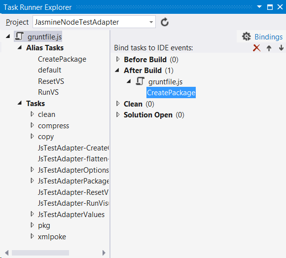

***This document is under construction!***

To demonstrate how this library is used I will implement a test adapter for [Jasmine](http://jasmine.github.io/) tests run in [Node.js](https://nodejs.org/).

The test adapter will be found on GitHub: [JasmineNodeTestAdapter](https://github.com/MortenHoustonLudvigsen/JasmineNodeTestAdapter).

# Prerequisites

Before creating a test adapter using JsTestAdapter the following should be installed:

* [Node.js](https://nodejs.org/)

* [Microsoft Visual Studio 2013 SDK](https://visualstudiogallery.msdn.microsoft.com/842766ba-1f32-40cf-8617-39365ebfc134)

* Visual Studio extension [Task Runner Explorer](https://visualstudiogallery.msdn.microsoft.com/8e1b4368-4afb-467a-bc13-9650572db708)

* Visual Studio extension [TypeScript 1.4 for Visual Studio 2013](https://visualstudiogallery.msdn.microsoft.com/2d42d8dc-e085-45eb-a30b-3f7d50d55304)

It might also be helpful to install:

* Node module [Grunt CLI](http://gruntjs.com/using-the-cli)

  ````
  npm install -g grunt-cli
  ```` 

* Node module [tsd](https://www.npmjs.com/package/tsd)

  ````
  npm install -g tsd
  ````

* Visual Studio extension [File Nesting](https://visualstudiogallery.msdn.microsoft.com/3ebde8fb-26d8-4374-a0eb-1e4e2665070c)

# Set up solution and project

Create a new "HTML Application with TypeScript" in Visual Studio 2013 called "JasmineNodeJsTestAdapter" (make sure to check `Create directory for solution`).


Once this is done, the solution explorer should look something like this:


Delete all the files, that are added by default:


In the properties for the project make sure typescript files are compiled as "CommonJS" modules:


Now the JsTestAdapter NuGet package is installed:


Once JsTestAdapter is installed the solution should look something like this:


The Task Runner Explorer looks like (it might be necessary to run `nmp install` from a command prompt, and to click the Refresh button in the Task Runner Explorer):


I can now build the solution, and double click the `CreatePackage` grunt task in the Task Runner Explorer. If I show all files in the Solution Explorer, I should see that a package `JasmineNodeJsTestAdapter.vsix` has been created:


To automate the creation of the package we bind the `CreatePackage` task to the `After Build` event in the Task Runner Explorer:



From now on the package `JasmineNodeJsTestAdapter.vsix` will be created after every build.

## Solution level files

To keep track of solution level files, I create a new solution folder `Solution Files`, and add the files in the solution directory: 


Notice, that I have created a `LICENSE` file with the MIT License.

## package.json

A `package.json` file has been generated, and looks like:

````Json
{
  "name": "JasmineNodeTestAdapter",
  "version": "0.0.1",
  "private": true,
  "devDependencies": {
    "extend": "^2.0.0",
    "flatten-packages": "^0.1.4",
    "grunt": "^0.4.5",
    "grunt-contrib-clean": "^0.6.0",
    "grunt-contrib-compress": "^0.13.0",
    "grunt-contrib-copy": "^0.8.0",
    "grunt-exec": "^0.4.6",
    "grunt-nuget": "^0.1.4",
    "grunt-xmlpoke": "^0.8.0",
    "regedit": "^2.1.0",
    "semver": "^4.3.1",
    "string-template": "^0.2.0",
    "xmlbuilder": "^2.6.2",
    "zpad": "^0.5.0"
  },
  "dependencies": {
    "error-stack-parser": "^1.1.2",
    "iconv-lite": "^0.4.7",
    "q": "^1.2.0",
    "source-map": "^0.4.0",
    "source-map-resolve": "^0.3.1",
    "stackframe": "^0.2.2",
    "yargs": "^3.5.4"
  }
}
````

The version of the package `JasmineNodeJsTestAdapter.vsix` is generated from the `version` property in `package.json` when the `CreatePackage` task is run, so this is where the current version of the package is maintained.

## source.extension.vsixmanifest

A `source.extension.vsixmanifest` file has been generated, and looks like:

````xml
<?xml version="1.0" encoding="utf-8"?>
<PackageManifest Version="2.0.0" xmlns="http://schemas.microsoft.com/developer/vsx-schema/2011">
  <Metadata>
    <Identity Id="JasmineNodeTestAdapter.25d980f5-bb63-4cae-8dd4-b165922e9c98" Version="x.x.x" Language="en-US" Publisher="" />
    <DisplayName>JasmineNodeTestAdapter</DisplayName>
    <Description xml:space="preserve">JasmineNodeTestAdapter</Description>
    <MoreInfo></MoreInfo>
    <License></License>
  </Metadata>
  <Installation>
    <InstallationTarget Version="[12.0,14.0]" Id="Microsoft.VisualStudio.Pro" />
    <InstallationTarget Version="[12.0,14.0]" Id="Microsoft.VisualStudio.Premium" />
    <InstallationTarget Version="[12.0,14.0]" Id="Microsoft.VisualStudio.Ultimate" />
  </Installation>
  <Dependencies>
    <Dependency Id="Microsoft.Framework.NDP" DisplayName="Microsoft .NET Framework" Version="[4.5,)" />
  </Dependencies>
  <Assets>
    <Asset Type="Microsoft.VisualStudio.MefComponent" Path="JasmineNodeTestAdapter.dll" />
    <Asset Type="UnitTestExtension" Path="JasmineNodeTestAdapter.dll" />
  </Assets>
</PackageManifest>

````

I want to fill out `Publisher` attribute of the `Identity` element:

````xml
<Identity Id="JasmineNodeTestAdapter.25d980f5-bb63-4cae-8dd4-b165922e9c98" Version="x.x.x" Language="en-US" Publisher="Morten Houston Ludvigsen" />
````

Also, I want to fill out the `MoreInfo` and `License` elements:


````xml
<MoreInfo>https://github.com/MortenHoustonLudvigsen/JasmineNodeTestAdapter</MoreInfo>
<License>LICENSE</License>
````

Notice, that I don't change the `Version` attribute of the `Identity` element. This is handled by the `CreatePackage` grunt task.

## Gruntfile.js

I will be creating a node program to run Jasmine tests in a new directory: `JasmineTestServer`, and I will be a solution with test projects under a new directory `TestProjects` in the main solution directory. Therefore I change `Gruntfile.js` accordingly:

````JavaScript
var jsTestAdapter = require('./Grunt/Index');

module.exports = function (grunt) {
    grunt.initConfig({
    });

    jsTestAdapter.config(grunt, {
        name: 'JasmineNodeTestAdapter',
        lib: 'JasmineTestServer',
        bin: 'bin',
        rootSuffix: 'JasmineNodeTestAdapter',
        testProject: '../TestProjects/TestProjects.sln'
    });

    grunt.registerTask('CreatePackage', [
        'clean:JsTestAdapter',
        'copy:JsTestAdapter',
        'JsTestAdapter-flatten-packages',
        'xmlpoke:JsTestAdapter-vsix',
        'JsTestAdapter-CreateContentTypes',
        'compress:JsTestAdapter'
    ]);

    grunt.registerTask('ResetVS', [
        'JsTestAdapter-ResetVisualStudio'
    ]);

    grunt.registerTask('RunVS', [
        'JsTestAdapter-ResetVisualStudio',
        'JsTestAdapter-RunVisualStudio'
    ]);

    grunt.registerTask('default', ['CreatePackage']);
}
````

# Test Projects

Before I start implementing the test adapter, I want to make a simple test project.

In the main solution directory I create a new empty solution named "TestProjects": 


I like working in TypeScript, so I will use it to implement tests. This will also demonstrate that source mapping works.

In the test solution I create a new "HTML Application with TypeScript" named "TypescriptTests" (as before, I delete all the files, that are added by default):


I also configure TypeScript to use CommonJS modules:


I add a `package.json` file to track node modules:

````JSON
{
    "name": "TypescriptTests",
    "version": "0.0.0",
    "private": true
}
````

I need the TypeScript definitions for Jasmine, so I jump to a command prompt and run:

````
cd C:\Git\JasmineNodeTestAdapter\TestProjects\TypescriptTests 
tsd query jasmine --action install --save
```` 

I include the generated files in the test project.

To have something to test, I add a TypeScript file `Adder.ts` in new folder `src`:

````JavaScript
export function add(a: number, b: number): number {
    return a + b;
}
````

I want a handfull of Jasmine tests, so I create TypeScript file `AdderSpec.ts` in new folder `specs`:

````JavaScript
import Adder = require('../src/Adder');

describe('Adder',() => {
    describe('add',() => {
        // This spec should succeed:
        describe('(3, 3)',() => {
            it('should return 6',() => expect(Adder.add(3, 3)).toEqual(6));
        });

        // This spec should succeed:
        describe('(3, 6)',() => {
            it('should return 9',() => expect(Adder.add(3, 6)).toEqual(9));
        });

        // This spec should fail:
        describe('(3, 7)',() => {
            it('should return 9',() => expect(Adder.add(3, 7)).toEqual(9));
        });
    });
});
````

My test project now looks like:


Notice, that I have used [File Nesting](https://visualstudiogallery.msdn.microsoft.com/3ebde8fb-26d8-4374-a0eb-1e4e2665070c) to nest the `.js` and `.js.map` files produced by the TypeScript compiler under the corresponding `.ts` file.


npm install jasmine --save-dev
npm install glob --save
npm install gaze --save
npm install log4js --save

tsd query glob --action install --save
tsd query log4js --action install --save
tsd query express --action install --save
tsd query minimatch --action install --save

