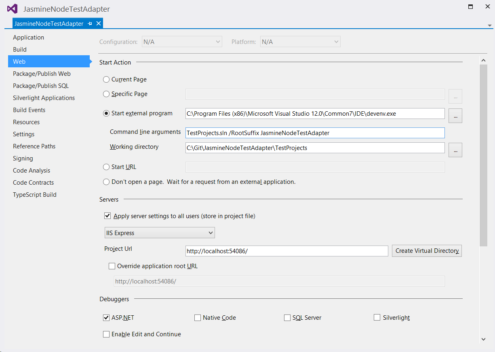

***This document is under construction!***

To demonstrate how this library is used I will implement a test adapter for [Jasmine](http://jasmine.github.io/) tests run in [Node.js](https://nodejs.org/).

The test adapter will be found on GitHub: [JasmineNodeTestAdapter](https://github.com/MortenHoustonLudvigsen/JasmineNodeTestAdapter).

# Prerequisites

Before creating a test adapter using JsTestAdapter the following should be installed:

* [Node.js](https://nodejs.org/)

* [Microsoft Visual Studio 2013 SDK](https://visualstudiogallery.msdn.microsoft.com/842766ba-1f32-40cf-8617-39365ebfc134)

* Visual Studio extension [Task Runner Explorer](https://visualstudiogallery.msdn.microsoft.com/8e1b4368-4afb-467a-bc13-9650572db708)

* Visual Studio extension [TypeScript 1.4 for Visual Studio 2013](https://visualstudiogallery.msdn.microsoft.com/2d42d8dc-e085-45eb-a30b-3f7d50d55304)

It might also be helpful to install:

* Node module [Grunt CLI](http://gruntjs.com/using-the-cli)

  ````
  npm install -g grunt-cli
  ```` 

* Node module [tsd](https://www.npmjs.com/package/tsd)

  ````
  npm install -g tsd
  ````

* Visual Studio extension [File Nesting](https://visualstudiogallery.msdn.microsoft.com/3ebde8fb-26d8-4374-a0eb-1e4e2665070c)

# Architecture

The test adapter will be made up of three components:

* The Jasmine runner
  This will be a node program, that runs a set of Jasmine tests once, and reports the results to the test server. 

* The test server
  This will be a node program, that runs in the background running the Jasmine runner when needed, and reporting the results to the test adapter.

* The test adapter
  This will be the Test Explorer adapter, implementet in C#, that will start a test server for each set of tests, and will respond to events from the test servers by updating the Test Explorer.

## Configuration

The test adapter will be configured using a JSON file named `JasmineNodeTestAdapter.json`.

````JSON
{
    "$schema": "http://MortenHoustonLudvigsen.github.io/JasmineNodeTestAdapter/JasmineNodeTestAdapter.schema.json",
    "Name": "My tests",
    "BasePath": ".",
    "Helpers": [ "specs/**/*[Hh]elper.js" ],
    "Specs": [ "specs/**/*[Ss]pec.js" ],
    "Watch": [ "src/**/*.js" ],
    "Extensions": "./Extensions",
    "Traits": [ "Jasmine", { "Name": "Foo", "Value": "Bar" } ],
    "Disabled": false,
    "LogToFile": true,
    "LogDirectory": "TestResults/JasmineTestAdapter"
}
````   

These are the possible properties (all properties are optional):

* `$schema` Set to "<http://MortenHoustonLudvigsen.github.io/JasmineNodeTestAdapter/JasmineNodeTestAdapter.schema.json>" to get
  intellisense for `JasmineNodeTestAdapter.json`.

* `Name` The name of the test container. Used in the default generation of the fully qualified name for each test.

* `BasePath` The base path to use to resolve file paths. Defaults to the directory in which `JasmineNodeTestAdapter.json` resides.

* `Helpers` Non-source, non-spec helper files. Loaded before any specs. Wildcards can be used - see [glob](https://www.npmjs.com/package/glob).

* `Specs` Files containing Jasmine specs. Wildcards can be used - see [glob](https://www.npmjs.com/package/glob).

* `Watch` A test run is triggered if any file specified in `Helpers` or `Specs` change. Add any files in `Watch` that should also trigger a test run when they change. These will typically be the source files. Wildcards can be used - see [glob](https://www.npmjs.com/package/glob).

* `Traits` An array of traits to be attached to each test. A trait can be a string or an object containing properties `Name` and `Value`. A trait specified as a string or with only a name will be shown in the Test Explorer as just the string or name.

* `Extensions` Path to a node.js module implementing extensions.

* `Disabled` Set to true, if the test adapter should be disabled for this configuration file.

* `LogToFile` Set to true, if you want the adapter to write log statements to a log file (named JasmineNodeTestAdapter.log).

* `LogDirectory` Where the log file should be saved (if LogToFile is true). If this property is not specified the directory in which JasmineNodeTestAdapter.json resides is used.

`JasmineNodeTestAdapter.json` must be encoded in one of the following encodings:

* UTF-8
* UTF-8 with BOM / Signature
* UTF-16 Big-Endian with BOM / Signature
* UTF-16 Little-Endian with BOM / Signature

# Set up solution and project

Create a new "HTML Application with TypeScript" in Visual Studio 2013 called "JasmineNodeJsTestAdapter" (make sure to check `Create directory for solution`).


Once this is done, the solution explorer should look something like this:


Delete all the files, that are added by default:


In the properties for the project make sure typescript files are compiled as "CommonJS" modules:


Now the JsTestAdapter NuGet package is installed:


Once JsTestAdapter is installed the solution should look something like this:


The Task Runner Explorer looks like (it might be necessary to run `nmp install` from a command prompt, and to click the Refresh button in the Task Runner Explorer):


I can now build the solution, and double click the `CreatePackage` grunt task in the Task Runner Explorer. If I show all files in the Solution Explorer, I should see that a package `JasmineNodeJsTestAdapter.vsix` has been created:


To automate the creation of the package we bind the `CreatePackage` task to the `After Build` event in the Task Runner Explorer:


From now on the package `JasmineNodeJsTestAdapter.vsix` will be created after every build.

## Solution level files

To keep track of solution level files, I create a new solution folder `Solution Files`, and add the files in the solution directory: 


Notice, that I have created a `LICENSE` file with the MIT License.

## package.json

A `package.json` file has been generated, and looks like:

````Json
{
  "name": "JasmineNodeTestAdapter",
  "version": "0.0.1",
  "private": true,
  "devDependencies": {
    "extend": "^2.0.0",
    "flatten-packages": "^0.1.4",
    "grunt": "^0.4.5",
    "grunt-contrib-clean": "^0.6.0",
    "grunt-contrib-compress": "^0.13.0",
    "grunt-contrib-copy": "^0.8.0",
    "grunt-exec": "^0.4.6",
    "grunt-nuget": "^0.1.4",
    "grunt-xmlpoke": "^0.8.0",
    "regedit": "^2.1.0",
    "semver": "^4.3.1",
    "string-template": "^0.2.0",
    "xmlbuilder": "^2.6.2",
    "zpad": "^0.5.0"
  },
  "dependencies": {
    "error-stack-parser": "^1.1.2",
    "iconv-lite": "^0.4.7",
    "q": "^1.2.0",
    "source-map": "^0.4.0",
    "source-map-resolve": "^0.3.1",
    "stackframe": "^0.2.2",
    "yargs": "^3.5.4"
  }
}
````

The version of the package `JasmineNodeJsTestAdapter.vsix` is generated from the `version` property in `package.json` when the `CreatePackage` task is run, so this is where the current version of the package is maintained.

## source.extension.vsixmanifest

A `source.extension.vsixmanifest` file has been generated, and looks like:

````xml
<?xml version="1.0" encoding="utf-8"?>
<PackageManifest Version="2.0.0" xmlns="http://schemas.microsoft.com/developer/vsx-schema/2011">
  <Metadata>
    <Identity Id="JasmineNodeTestAdapter.25d980f5-bb63-4cae-8dd4-b165922e9c98" Version="x.x.x" Language="en-US" Publisher="" />
    <DisplayName>JasmineNodeTestAdapter</DisplayName>
    <Description xml:space="preserve">JasmineNodeTestAdapter</Description>
    <MoreInfo></MoreInfo>
    <License></License>
  </Metadata>
  <Installation>
    <InstallationTarget Version="[12.0,14.0]" Id="Microsoft.VisualStudio.Pro" />
    <InstallationTarget Version="[12.0,14.0]" Id="Microsoft.VisualStudio.Premium" />
    <InstallationTarget Version="[12.0,14.0]" Id="Microsoft.VisualStudio.Ultimate" />
  </Installation>
  <Dependencies>
    <Dependency Id="Microsoft.Framework.NDP" DisplayName="Microsoft .NET Framework" Version="[4.5,)" />
  </Dependencies>
  <Assets>
    <Asset Type="Microsoft.VisualStudio.MefComponent" Path="JasmineNodeTestAdapter.dll" />
    <Asset Type="UnitTestExtension" Path="JasmineNodeTestAdapter.dll" />
  </Assets>
</PackageManifest>

````

I want to fill out `Publisher` attribute of the `Identity` element:

````xml
<Identity Id="JasmineNodeTestAdapter.25d980f5-bb63-4cae-8dd4-b165922e9c98" Version="x.x.x" Language="en-US" Publisher="Morten Houston Ludvigsen" />
````

Also, I want to fill out the `MoreInfo` and `License` elements:


````xml
<MoreInfo>https://github.com/MortenHoustonLudvigsen/JasmineNodeTestAdapter</MoreInfo>
<License>LICENSE</License>
````

Notice, that I don't change the `Version` attribute of the `Identity` element. This is handled by the `CreatePackage` grunt task.

## Gruntfile.js

I will be creating a node program to run Jasmine tests in a new directory: `JasmineTestServer`, and I will be creating a solution with test projects under a new directory `TestProjects` in the main solution directory. Therefore I change `Gruntfile.js` accordingly:

````JavaScript
var jsTestAdapter = require('./Grunt/Index');

module.exports = function (grunt) {
    grunt.initConfig({
    });

    jsTestAdapter.config(grunt, {
        name: 'JasmineNodeTestAdapter',
        lib: 'JasmineTestServer',
        bin: 'bin',
        rootSuffix: 'JasmineNodeTestAdapter',
        testProject: '../TestProjects/TestProjects.sln'
    });

    grunt.registerTask('CreatePackage', [
        'clean:JsTestAdapter',
        'copy:JsTestAdapter',
        'JsTestAdapter-flatten-packages',
        'xmlpoke:JsTestAdapter-vsix',
        'JsTestAdapter-CreateContentTypes',
        'compress:JsTestAdapter'
    ]);

    grunt.registerTask('ResetVS', [
        'JsTestAdapter-ResetVisualStudio'
    ]);

    grunt.registerTask('RunVS', [
        'JsTestAdapter-ResetVisualStudio',
        'JsTestAdapter-RunVisualStudio'
    ]);

    grunt.registerTask('default', ['CreatePackage']);
}
````

# Test Projects

Before I start implementing the test adapter, I want to make a simple test project.

In the main solution directory I create a new empty solution named "TestProjects": 


I like working in TypeScript, so I will use it to implement tests. This will also demonstrate that source mapping works.

In the test solution I create a new "HTML Application with TypeScript" named "TypescriptTests" (as before, I delete all the files, that are added by default):


I also configure TypeScript to use CommonJS modules:


I add a `package.json` file to track node modules (I make sure that it is saved as UTF-8 without signature - otherwise npm will not be able to update it):

````JSON
{
    "name": "TypescriptTests",
    "version": "0.0.0",
    "private": true
}
````

I need to install Jasmine, so I jump to a command prompt and run:

````bat
cd C:\Git\JasmineNodeTestAdapter\TestProjects\TypescriptTests 
npm install jasmine --save-dev
```` 

I also need the TypeScript definitions for Jasmine:

````bat
cd C:\Git\JasmineNodeTestAdapter\TestProjects\TypescriptTests 
tsd query jasmine --action install --save
```` 

I include the generated files in the test project (not `node_modules`).

To have something to test, I add a TypeScript file `Adder.ts` in new folder `src`:

````JavaScript
export function add(a: number, b: number): number {
    return a + b;
}
````

I want a handful of Jasmine tests, so I create TypeScript file `AdderSpec.ts` in new folder `specs`:

````JavaScript
import Adder = require('../src/Adder');

describe('Adder',() => {
    describe('add',() => {
        // This spec should succeed:
        describe('(3, 3)',() => {
            it('should return 6',() => expect(Adder.add(3, 3)).toEqual(6));
        });

        // This spec should succeed:
        describe('(3, 6)',() => {
            it('should return 9',() => expect(Adder.add(3, 6)).toEqual(9));
        });

        // This spec should fail:
        describe('(3, 7)',() => {
            it('should return 9',() => expect(Adder.add(3, 7)).toEqual(9));
        });
    });
});
````

My test project now looks like:


Notice, that I have used [File Nesting](https://visualstudiogallery.msdn.microsoft.com/3ebde8fb-26d8-4374-a0eb-1e4e2665070c) to nest the `.js` and `.js.map` files produced by the TypeScript compiler under the corresponding `.ts` file.

# Testing the test adapter

I can now start an experimental instance of Visual Studio with the the latest build of the test adapter installed by double clicking the `RunVS` task in the Task Runner Explorer. The first time I do this, I am asked for my credentials in Visual Studio.

Visual Studio opens with the test project loaded (as set up in `Gruntfile.js`), and I can open the Test Explorer to see test results. Of course, until I have implemented the adapter, nothing is shown in the Test Explorer.  

***For this to work [Microsoft Visual Studio 2013 SDK](https://visualstudiogallery.msdn.microsoft.com/842766ba-1f32-40cf-8617-39365ebfc134) needs to be installed first.***

It is also possible to start the experimental instance of Visual Studio from the debugger. This can be set up in the project properties:



However, for this to work properly, the project needs to be built, and then the `ResetVS` task in the Task Runner Explorer needs to be run. All this *before* starting a debug session.

The reason for this is that the debug session starts *before* the `CreatePackage` task is finished running. Otherwise the `ResetVS` task could be a part of the `CreatePackage` task. As far as I can tell this has been fixed in Visual Studio 2015 CTP, where the debugger waits for the Task Runner Explorer to finish before starting. In this case one could create a task `AfterBuild` in `Gruntfile.js`, and bind that to the `After Build` event in the Task Runner Explorer, instead of `CreatePackage`:

````JavaScript
grunt.registerTask('AfterBuild', [
    'CreatePackage',
    'ResetVS'
]);
````

# JSON schema for the configuration file

To make it easier to configure the adapter by providing intellisense in Visual Studio, I create a JSON schema called `JasmineNodeTestAdapter.schema.json` in the solution directory, and add it to `Solution Files`:

````JSON
{
    "$schema": "http://json-schema.org/draft-04/schema#",
    "title": "JSON schema for JasmineNodeTestAdapter configuration files (JasmineNodeTestAdapter.json)",
    "type": "object",
    "additionalProperties": false,
    "properties": {
        "$schema": {
            "type": "string",
            "format": "uri"
        },
        "Name": {
            "description": "The name of the test container.",
            "type": "string"
        },
        "BasePath": {
            "description": "The base path to use to resolve file paths. Defaults to the directory in which JasmineNodeTestAdapter.json resides.",
            "type": "string"
        },
        "Helpers": {
            "description": "Non-source, non-spec helper files. Loaded before any specs. Wildcards can be used - see [glob](https://www.npmjs.com/package/glob).",
            "type": "array",
            "items": { "type": "string" }
        },
        "Specs": {
            "description": "Files containing Jasmine specs. Wildcards can be used - see [glob](https://www.npmjs.com/package/glob).",
            "type": "array",
            "items": { "type": "string" }
        },
        "Watch": {
            "description": "A test run is triggered if any file specified in `Helpers` or `Specs` change. Add any files in `Watch` that should also trigger a test run when they change. These will typically be the source files. Wildcards can be used - see [glob](https://www.npmjs.com/package/glob).",
            "type": "array",
            "items": { "type": "string" }
        },
        "Traits": {
            "description": "Traits to attach to each test.",
            "type": "array",
            "items": {
                "anyOf": [
                    { "type": "string" },
                    {
                        "type": "object",
                        "properties": {
                            "Name": { "type": "string" },
                            "Value": { "type": "string" }
                        },
                        "required": [ "Name" ]
                    }
                ]
            }
        },
        "Extensions": {
            "description": "Path to a node.js module implementing extensions.",
            "type": "string"
        },
        "Disabled": {
            "description": "Set to true, if the test adapter should be disabled for this configuration file.",
            "type": "boolean"
        },
        "LogToFile": {
            "description": "Set to true, if you want the adapter to write log statements to a log file (named JasmineNodeTestAdapter.log).",
            "type": "boolean"
        },
        "LogDirectory": {
            "description": "Where the log file should be saved (if LogToFile is true). If this property is not specified the directory in which JasmineNodeTestAdapter.json resides is used.",
            "type": "string"
        }
    }
}
```` 

# The Jasmine runner

Now I am ready to implement the test adapter. I will start with the Jasmine runner. As mentioned earlier, this will be a node program, that runs a set of Jasmine tests once, and reports the results to the test server.

The source code for the Jasmine runner and the test server will reside in new folder `JasmineTestServer` in the project.

## JasmineLogger.ts

JsTestAdapter defines an interface `Logger` (in `TestServer/Logger.ts`):

````JavaScript
interface Logger {
    info(message: string, ...args: any[]): void;
    warn(message: string, ...args: any[]): void;
    error(message: string, ...args: any[]): void;
    debug(message: string, ...args: any[]): void;
}
````

Objects implementing this interface will be needed in both the Jasmine runner and the test server.
  
A [log4js](https://www.npmjs.com/package/log4js) logger implements the `Logger` interface, so I will install it from a command prompt:

````bat
cd C:\Git\JasmineNodeTestAdapter\JasmineNodeTestAdapter
npm install log4js --save
````

I also want the TypeScript definitions for [log4js](https://www.npmjs.com/package/log4js) (which depend on definitions for [express](https://www.npmjs.com/package/express)):

````bat
cd C:\Git\JasmineNodeTestAdapter\JasmineNodeTestAdapter
tsd query log4js --action install --save
tsd query express --action install --save
````

This adds files to the `typings` folder, which I include in the project.

Now I can implement a function, that returns a `Logger` object given a category. I create `JasmineLogger.ts` (in the `JasmineTestServer` folder):

````JavaScript
import log4js = require('log4js');
import Logger = require('../TestServer/Logger');

log4js.configure({
    appenders: [
        {
            type: 'console',
            layout: {
                type: 'pattern',
                pattern: '%p [%c]: %m'
            }
        }
    ]
});

function JasmineLogger(category: string): Logger {
    return log4js.getLogger(category);
}

export = JasmineLogger;
````

## Settings.ts

I will need to read settings from `JasmineNodeTestAdapter.json` configuration files. Therefore i make an interface in `Settings.ts`:

````JavaScript
import Specs = require('../TestServer/Specs');

interface Settings {
    BasePath: string;
    Helpers: string[];
    Specs: string[];
    Watch: string[];
    Traits: (string|Specs.Trait)[];
    Extensions: string;
}

export = Settings;
````

Note that I import `../TestServer/Specs`, which contains a number of central interfaces defined in JsTestAdapter. Note also that I only define the properties I expect to need in the Jasmine runner and the test server.

## Constants.ts

I want default setting values. I implement this in `Constants.ts`:

````JavaScript
import Settings = require('./Settings');

export var defaultSettings = <Settings>{
    BasePath: process.cwd(),
    Helpers: [],
    Specs: [],
    Watch: [],
    Traits: [],
    Extensions: undefined
}; 
````

## Utils.ts

It is not enough to define an interface for settings. I also need to be able to read them from a file. I implement this in `Utils.ts`:

````JavaScript
import path = require('path');
import extend = require('extend');
import Settings = require('./Settings');
import Constants = require('./Constants');
import TextFile = require('../TestServer/TextFile');

export function loadSettings(settingsFile: string): Settings {
    var settings = <Settings>extend(Constants.defaultSettings, TextFile.readJson(settingsFile));

    // Use the directory of the settings file if settings.BasePath is not specified
    settings.BasePath = settings.BasePath || path.dirname(settingsFile);

    // Resolve paths to full paths
    settings.Helpers = settings.Helpers.map(pattern => path.resolve(settings.BasePath, pattern));
    settings.Specs = settings.Specs.map(pattern => path.resolve(settings.BasePath, pattern));
    settings.Watch = settings.Watch.map(pattern => path.resolve(settings.BasePath, pattern));

    // Watch helpers and specs as well
    settings.Watch = settings.Watch.concat(settings.Helpers).concat(settings.Specs);

    return settings;
}
````

Note that I read the settings file using the `TextFile` module from JsTestAdapter. This makes it possible to read files encoded in one of the following encodings:

* UTF-8
* UTF-8 with BOM / Signature
* UTF-16 Big-Endian with BOM / Signature
* UTF-16 Little-Endian with BOM / Signature

## JasmineRunner.ts

Next, I will implement the Jasmine runner itself.

First, I need to install [glob](https://www.npmjs.com/package/glob) so I can interpret the paths supplied in the settings file:

````bat
cd C:\Git\JasmineNodeTestAdapter\JasmineNodeTestAdapter
npm install glob --save
````

I also want the TypeScript definitions for [glob](https://www.npmjs.com/package/glob) (which depends on the definitions for [minimatch](https://www.npmjs.com/package/minimatch)):

````bat
cd C:\Git\JasmineNodeTestAdapter\JasmineNodeTestAdapter
tsd query glob --action install --save
tsd query minimatch --action install --save
````

This adds files to the `typings` folder, which I include in the project.

Now I can implement `JasmineRunnet.ts` (I will add a reporter to this later):

````JavaScript
import path = require('path');
import glob = require('glob');
import JasmineLogger = require('./JasmineLogger');
import Utils = require('./Utils');
var Jasmine = require('jasmine');

var argv = require('yargs')
    .usage('Usage: $0 --settings [settings file]')
    .demand(['settings'])
    .argv;

var logger = JasmineLogger('Jasmine Runner');

// Load settings
var settings = Utils.loadSettings(argv.settings);

// Create an Jasmine instance
var jasmine = new Jasmine({ projectBaseDir: settings.BasePath });

// Add helpers to jasmine
settings.Helpers.forEach(pattern => {
    glob.sync(pattern, { nodir: true }).forEach(f => {
        jasmine.addSpecFile(f);
    });
});

// Add specs to jasmine
settings.Specs.forEach(pattern => {
    glob.sync(pattern, { nodir: true }).forEach(f => {
        jasmine.addSpecFile(f);
    });
});

// Run the jasmine specs
jasmine.execute();
````

I should now be able to run the specs in my test project. To do this I open the `TestProjects.sln` solution.

To the `TypescriptTests` project, I add a `JasmineNodeTestAdapter.json` file:

````JSON
{
    "$schema": "http://MortenHoustonLudvigsen.github.io/JasmineNodeTestAdapter/JasmineNodeTestAdapter.schema.json",
    "Specs": [ "specs/**/*[Ss]pec.js" ],
    "Watch": [ "src/**/*.js" ]
}
````

I also add a batch script `Start.cmd`:

````bat
@ECHO OFF
setlocal

cd %~dp0
set CurrentDir=%CD%
cd %~dp0..\..
set SolutionDir=%CD%
set TestProjectsDir=%SolutionDir%\TestProjects
set JasmineRunner=%SolutionDir%\JasmineNodeTestAdapter\JasmineTestServer\JasmineRunner.js

:: Set NODE_PATH to simulate starting node from %CurrentDir%
set NODE_PATH=%CurrentDir%\node_modules
set NODE_PATH=%NODE_PATH%;%TestProjectsDir%\node_modules
set NODE_PATH=%NODE_PATH%;%SolutionDir%\node_modules;%AppData%\Roaming\npm\node_modules

:: Add the default path to the global node_modules:
set NODE_PATH=%NODE_PATH%;%AppData%\Roaming\npm\node_modules

:: Run jasmine specs using JasmineRunner.js
node "%JasmineRunner%" --settings "%CurrentDir%\JasmineNodeTestAdapter.json"
````

Now I can open a command prompt, and run `Start.cmd` with the following result:

````
Started
..F

Failures:
1) Adder add (3, 7) should return 9
  Message:
    Expected 10 to equal 9.
  Stack:
    Error: Expected 10 to equal 9.
        at Object.<anonymous> (C:\Git\JasmineNodeTestAdapter\TestProjects\TypescriptTests\specs\AdderSpec.js:14:80)

3 specs, 1 failure
Finished in 0.009 seconds
````

# Notes (this will disappear when the document is finished)

npm install gaze --save
